# pylego

Merging Raspberry Pi with Lego Power Functions

# Basics - Introduction

Want to bring programmability to your Lego creations? (LLMs, Computer Vision, SLAM, Naviation, RL, etc.)

Something like these (but with a brain):

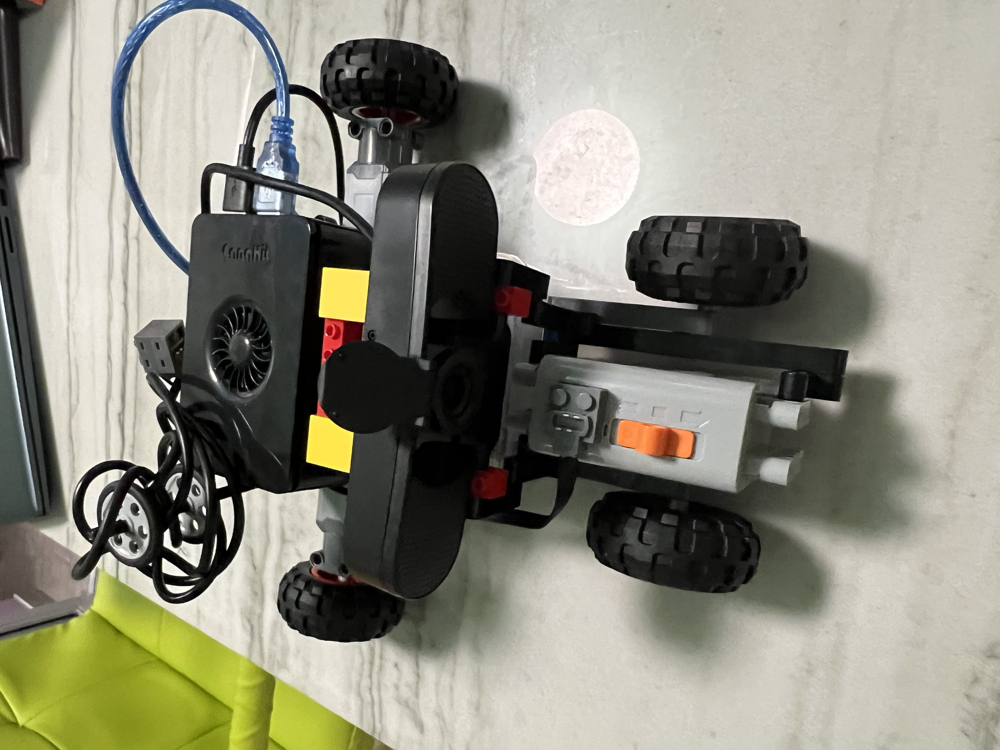

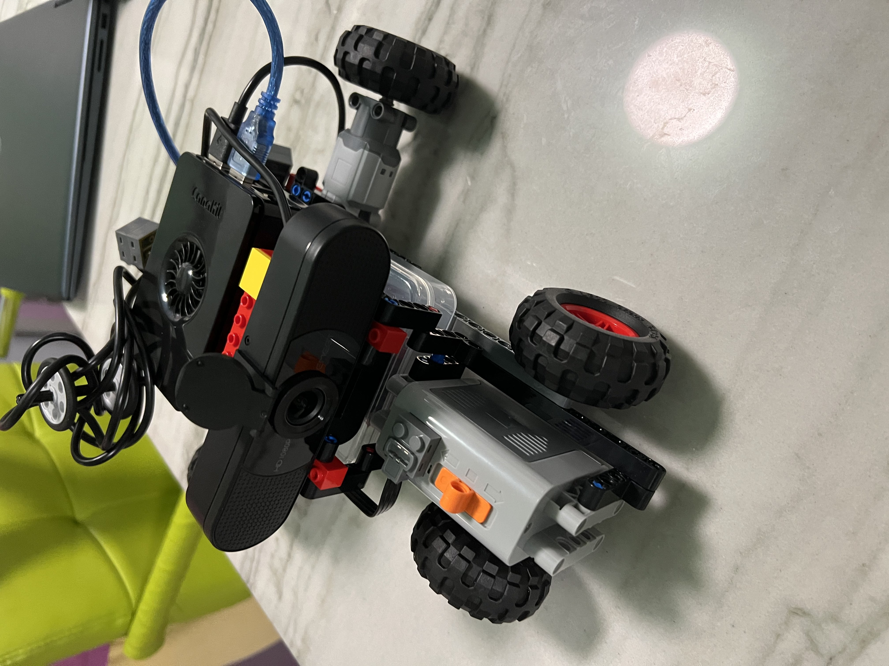

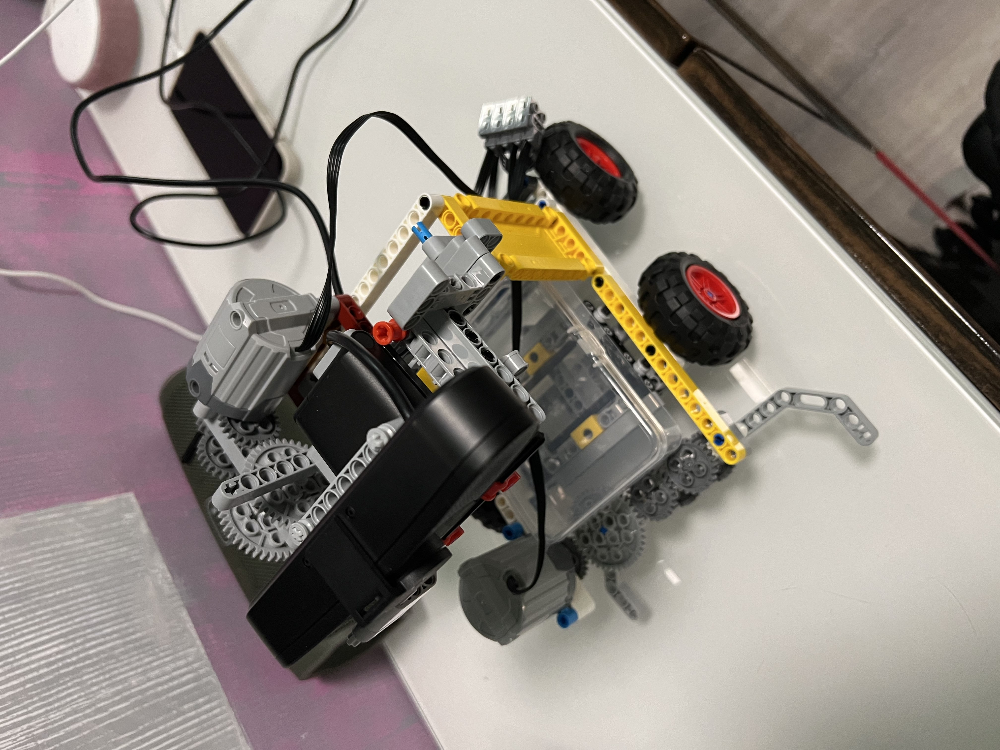

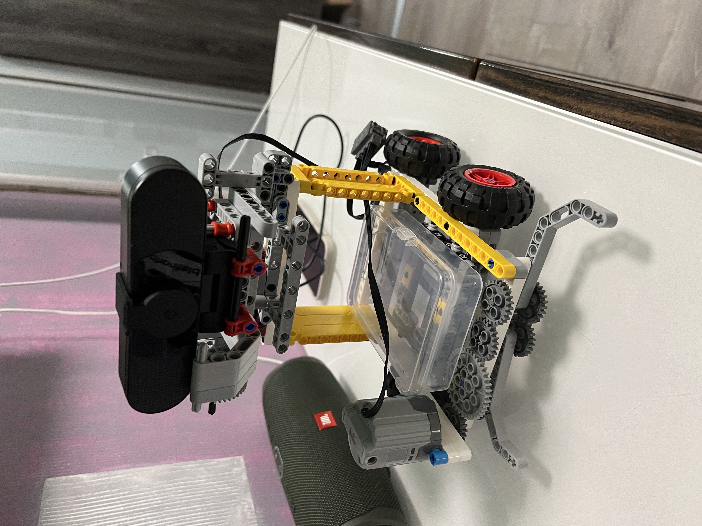

Here is some parts to get you started:

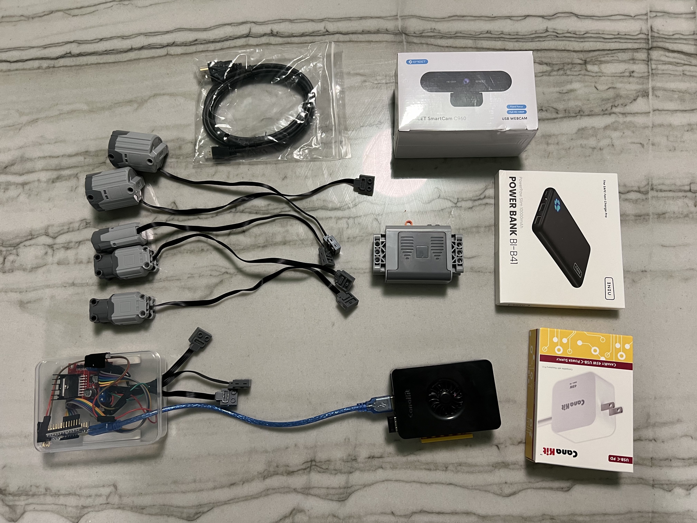

Eventually they will all wire together to something like this:

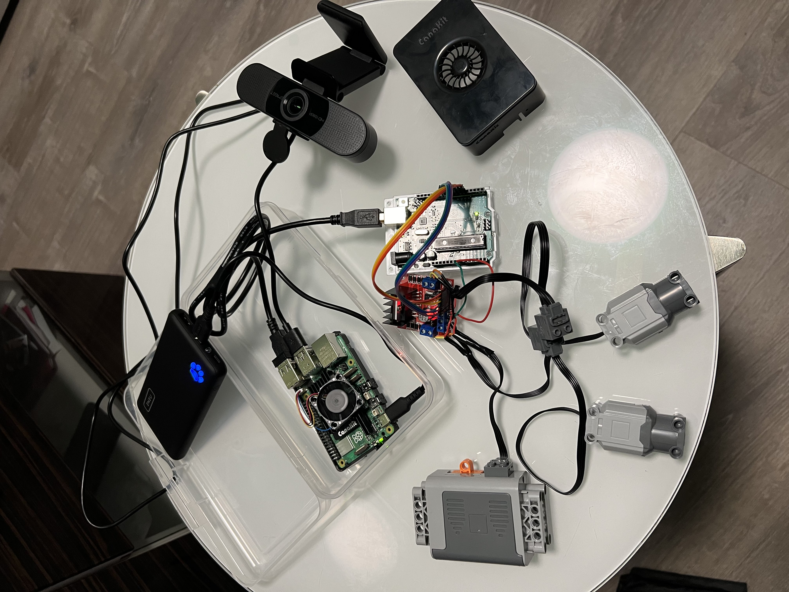

# Basics - Assembly

Lego Power Functions wiring to pylego motor driver:

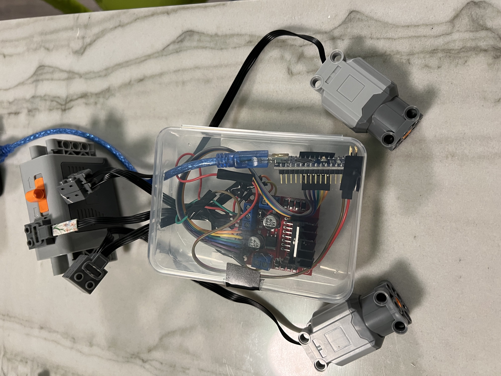

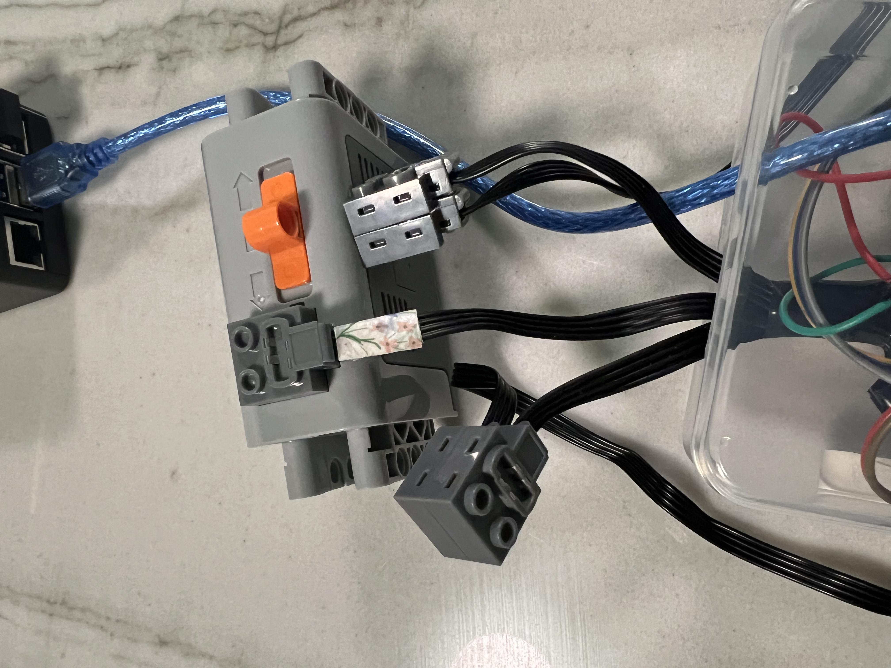

Lego attachments to pylego pi and motor driver:

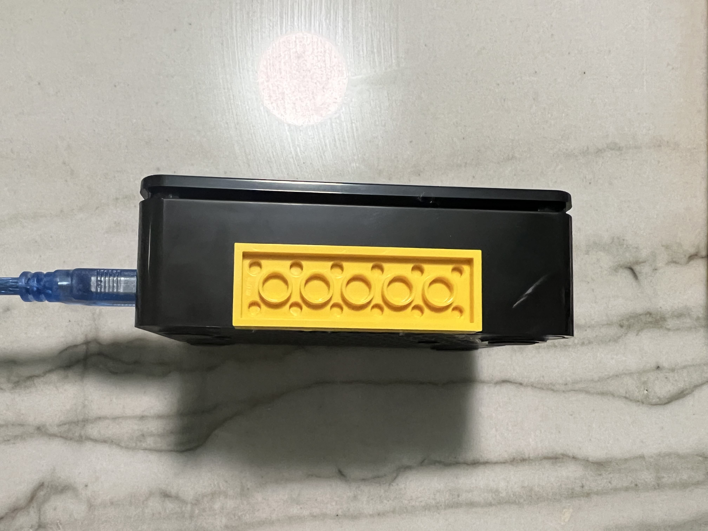

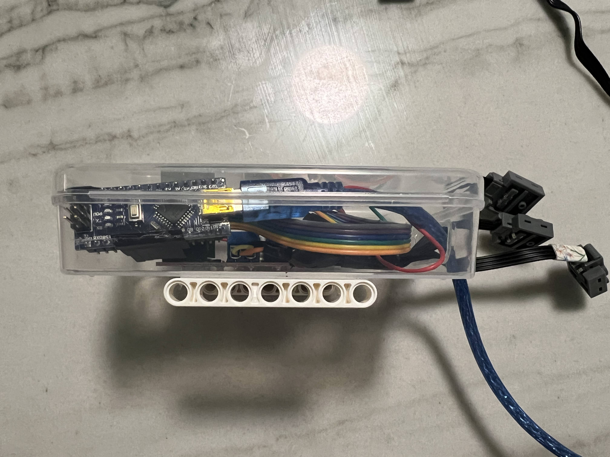

Lego Power Functions attaching to Legos:

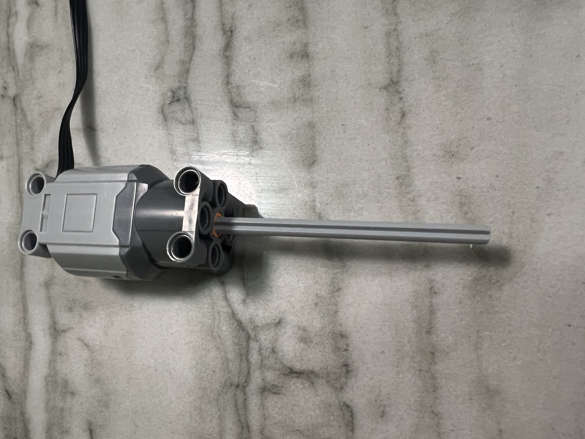

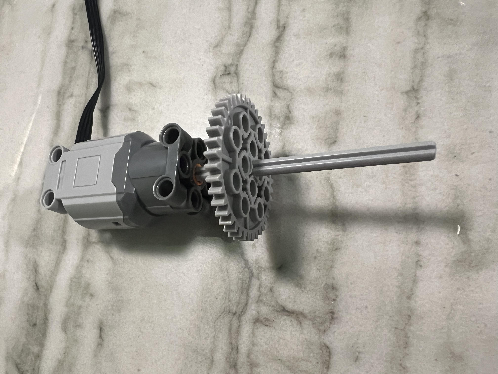

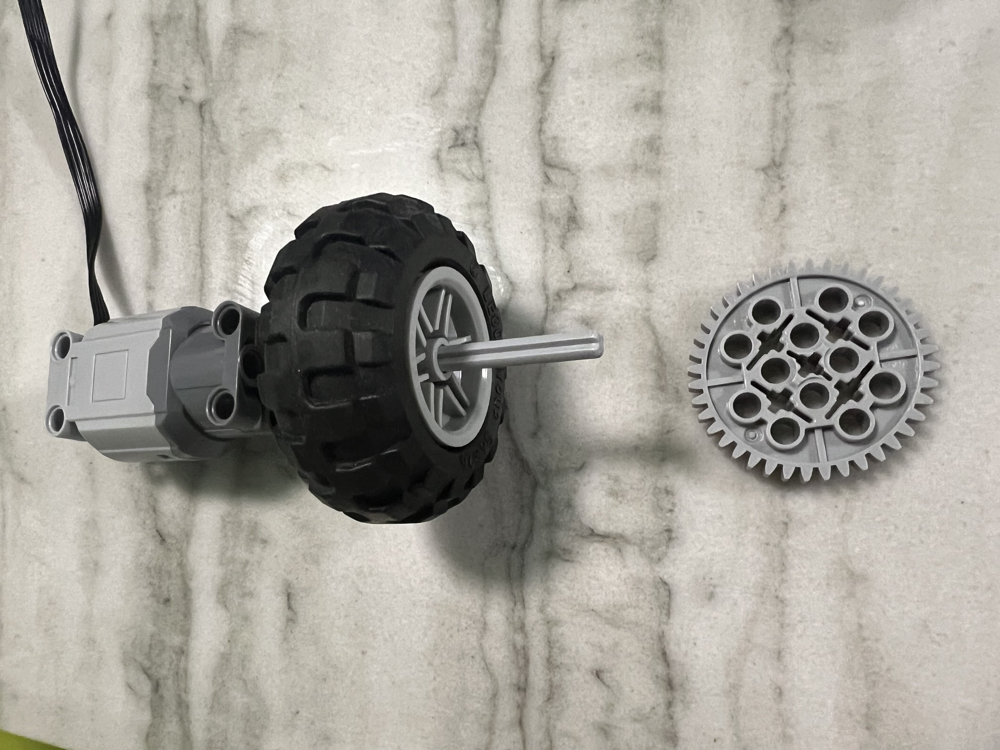

Now that it's assembled let's get started running code!

# Connect Keyboard and Monitor to Pi to get started
```
pi@raspberrypi: cat ~/Desktop/pylego/README.md
```

# FAQs

Q: Motors are not turning when running test code?
A: Try turning on the the Lego Power Function Power Box - this is needed to power the motors

Q: Cannot hear speaker when running test code?
A: Try connecting to bluetooth or selecting monitor speaker on raspberyy pi menu

Q: Do not have Google Gemini API Key?
A: https://ai.google.dev/

# Broken Still?

email wbm3.important(at)gmail.com for questions about fixes, patched, or bugs
# pylego.github.io
